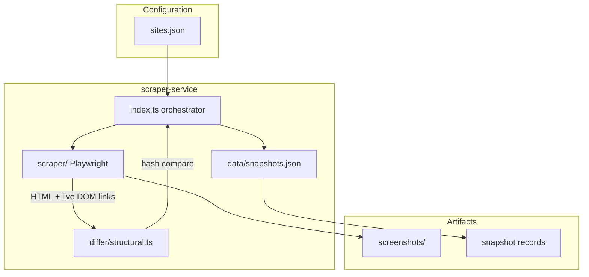
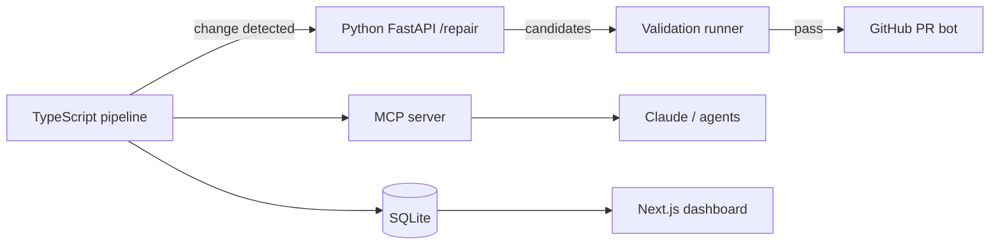

# Watchtower

**Automated web monitoring for documentation and product UIs** — capture pages with Playwright, extract navigation structure (including Shadow DOM), detect structural changes via hashing, and persist a full audit trail of screenshots and snapshots.

Built as a hybrid TypeScript monitoring pipeline, designed to grow into visual regression testing, LLM-assisted selector repair, and self-healing Playwright tests.

---

## Table of contents

- [Why Watchtower](#why-watchtower)
- [Features](#features)
- [Architecture](#architecture)
- [Quick start](#quick-start)
- [Configuration](#configuration)
- [How it works](#how-it-works)
- [Project structure](#project-structure)
- [Scripts](#scripts)
- [Roadmap](#roadmap)
- [License](#license)

---

## Why Watchtower

Documentation and marketing sites change often. Broken nav links, moved sidebar items, and refactored Web Component layouts break scrapers and Playwright tests silently. Watchtower gives you:

- **Repeatable captures** — headless Chromium, configurable ready selectors, full-page screenshots.
- **Structural fingerprints** — SHA-256 hashes over normalized navigation link sets, not brittle full-page HTML diffs.
- **Shadow DOM awareness** — traverses open shadow roots where Cheerio-only parsing fails (Stripe, AWS Console patterns, etc.).
- **Multi-site runs** — one config file, parallel execution, per-site failure isolation.

---

## Features

| Capability | Status |
| --- | --- |
| TypeScript + Playwright scraper | ✅ |
| Config-driven multi-site monitoring | ✅ |
| Cheerio HTML nav extraction | ✅ |
| Live DOM + Shadow DOM nav extraction | ✅ |
| SHA-256 structural change detection | ✅ |
| JSON snapshot history | ✅ |
| Full-page screenshots | ✅ |
| `robots.txt` respect (optional per site) | ✅ |
| Parallel site processing (`p-limit`) | ✅ |
| Node.js test suite (`tsx --test`) | ✅ |
| Visual regression (Pixelmatch / Sharp) | 🔜 Planned |
| SQLite persistence | 🔜 Planned |
| DOM noise filtering | 🔜 Planned |
| GitHub Actions scheduled runs | 🔜 Planned |
| Python LLM selector repair service | 🔜 Planned |
| MCP server + Next.js dashboard | 🔜 Planned |

---

## Architecture

**Current pipeline (Phase 1)**



**Target system (12-week roadmap)**



---

## Quick start

### Prerequisites

- **Node.js** 20+ (LTS recommended)
- **npm** 9+

Playwright downloads Chromium on first install.

### Install and run

```bash
git clone https://github.com/YOUR_USERNAME/watchtower.git
cd watchtower/scraper-service

npm install
npx playwright install chromium

npm start
```

On success you will see per-site logs (`CHANGE DETECTED` or `No change`), new files under `scraper-service/screenshots/`, and appended records in `scraper-service/data/snapshots.json`.

### Verify Shadow DOM extraction

```bash
npm run shadow-test
```

Exits with code `0` when nav links are found inside a known Shadow DOM fixture.

### Run tests

```bash
npm test
```

---

## Configuration

Monitored sites live in [`scraper-service/src/config/sites.json`](scraper-service/src/config/sites.json).

| Field | Required | Description |
| --- | --- | --- |
| `name` | Yes | Display name used in logs and snapshot records |
| `url` | Yes | Page URL to monitor |
| `readySelector` | Yes | CSS selector that indicates the page is ready (e.g. `nav`) |
| `navSelectors` | No | Custom selectors for link extraction; defaults cover `nav`, `[role="navigation"]`, etc. |
| `pierceShadowDom` | No | Query live DOM + shadow roots (default: `true`) |
| `respectRobotsTxt` | No | Skip URLs disallowed by `robots.txt` (default: unset → not checked unless `true`) |
| `maxRequestsPerRun` | No | Reserved for rate limiting (future use) |

**Example entry**

```json
{
  "name": "Stripe Docs",
  "url": "https://docs.stripe.com",
  "readySelector": "nav",
  "navSelectors": [
    "nav[aria-label='Main navigation'] a[href]",
    "nav a[href]"
  ],
  "respectRobotsTxt": true,
  "pierceShadowDom": true
}
```

Invalid entries are skipped with an error log; the rest of the run continues.

---

## How it works

1. **Load config** — `sites.json` is validated and processed concurrently (up to 5 sites at a time).
2. **Optional robots check** — when `respectRobotsTxt` is enabled, Watchtower fetches and caches `robots.txt` per origin.
3. **Capture** — Playwright opens the URL, waits for `readySelector` (with network-idle fallback), saves a full-page PNG, and returns page HTML.
4. **Extract navigation** — links are collected as `label::href` strings from:
   - static HTML via **Cheerio**, and
   - the **live DOM** (including open shadow roots) when `pierceShadowDom` is enabled.
5. **Hash** — the merged, sorted link set is `JSON.stringify` → **SHA-256**.
6. **Compare** — the latest snapshot for that URL is loaded from `data/snapshots.json`; hash mismatch → **change detected**.
7. **Persist** — every run appends a snapshot (hash, timestamp, screenshot path) regardless of change status.

---

## Project structure

```
watchtower/
├── .github/workflows/
│   └── monitor.yml          # CI placeholder (scheduled runs planned)
├── scraper-service/
│   ├── src/
│   │   ├── index.ts         # Main orchestrator
│   │   ├── config/
│   │   │   └── sites.json   # Monitored URLs
│   │   ├── scraper/
│   │   │   ├── index.ts     # Playwright capture
│   │   │   └── shadowNav.ts # Shadow DOM nav extraction
│   │   ├── differ/
│   │   │   └── structural.ts
│   │   ├── db/
│   │   │   └── index.ts     # Snapshot persistence
│   │   ├── types/
│   │   ├── utils/
│   │   └── shadowdom.ts     # Shadow DOM smoke test entry
│   ├── data/
│   │   └── snapshots.json   # Snapshot history
│   └── screenshots/         # Captured PNGs (gitignored locally)
└── README.md
```

---

## Scripts

All commands run from `scraper-service/`:

| Command | Description |
| --- | --- |
| `npm start` | Run the full monitoring pipeline |
| `npm test` | Run structural differ unit tests |
| `npm run shadow-test` | Shadow DOM smoke test |

---

## Roadmap

Watchtower follows a phased build plan:

| Phase | Focus | Highlights |
| --- | --- | --- |
| **1** (current) | Core monitoring | Playwright, structural hashing, multi-site config |
| **2** | Visual + automation | Pixelmatch diffs, modular refactor, GitHub Actions cron |
| **3** | AI + observability | FastAPI selector repair, MCP tools, Next.js dashboard |
| **4** | Self-healing | Validated auto-PRs, confidence tiers, blast-radius limits |

Contributions and issues welcome as phases land.

---

## License

ISC — see [`scraper-service/package.json`](scraper-service/package.json).
