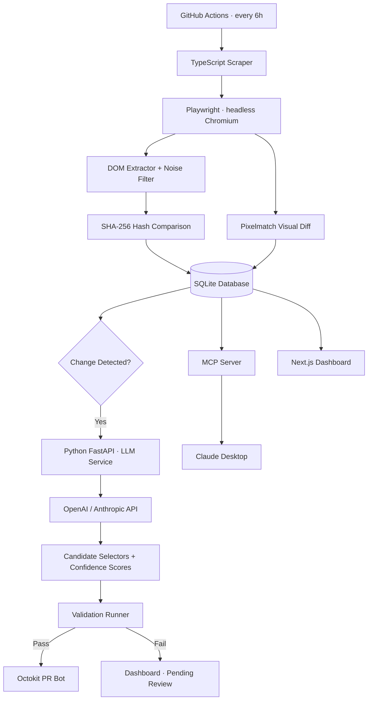

# 🗼 Watchtower

> A self-healing UI monitoring system that detects web changes, generates AI-powered test fixes, and opens GitHub PRs — automatically.

---

## What It Does

Watchtower continuously monitors web pages for structural and visual changes. When a UI breaks your Playwright tests, it uses an LLM to suggest selector repairs, validates the fix in isolation, and opens a pull request — all without human intervention.

**The full loop:** Detect change → identify broken tests → LLM suggests fix → validate fix → open PR.

---

## Current Status

Watchtower is being built in a 12-week hybrid roadmap. **Phase 1 (core monitoring) is in progress.**

| Component | Status |
| --- | --- |
| TypeScript + Playwright scraping | ✅ Done |
| Shadow DOM nav extraction | ✅ Done |
| Cheerio DOM parsing + SHA-256 structural diff | ✅ Done |
| Multi-site config (`sites.json`) | ✅ Done |
| JSON snapshot persistence | ✅ Done |
| SQLite, noise filter, retry logic | ✅ Done |
| Pixelmatch visual diff + summarizer | ✅ Done |
| GitHub Actions scheduled runs | ✅ Done |
| Python LLM repair service | 🚧 Week 6–7 |
| MCP server + Next.js dashboard | 🚧 Week 8–9 |
| Validation runner + PR bot + safety tiers | 🚧 Week 10–11 |

---

## Architecture



---

## Features

### 🟢 Phase 1 — Core Monitoring
- Headless browser scraping via Playwright with Shadow DOM support ✅
- Structural change detection using SHA-256 hashing of navigation structure ✅
- Visual regression with Pixelmatch pixel-level comparison + red-highlighted diff images 🚧
- Noise filtering removes timestamps, avatars, ads, and CSRF tokens to eliminate false positives 🚧
- SQLite persistence stores full snapshot history 🚧 *(JSON snapshots today)*
- Multi-site support via `sites.json` config ✅
- Retry logic with exponential backoff 🚧

### 🟡 Phase 2 — Automation
- GitHub Actions runs the full pipeline every 6 hours 🚧
- Auto-commits screenshots, diffs, and DB updates to the repo 🚧

### 🟠 Phase 3 — AI & Observability
- Python FastAPI microservice calls an LLM to suggest broken selector repairs 🚧
- Returns 3 ranked candidates with confidence scores, selector strategy, and explanation 🚧
- TypeScript pipeline calls the repair service automatically after any detected change 🚧
- MCP server exposes `get_latest_layout` and `get_change_history` tools to Claude Desktop 🚧
- Next.js dashboard with live site status, change timelines, and side-by-side diff images 🚧

### 🔵 Phase 4 — Self-Healing & Safety
- Validation runner (Docker or GitHub Actions) tests LLM fixes before any PR is opened 🚧
- Octokit PR bot creates branches and opens PRs with embedded diff images and confidence scores 🚧
- Tiered automation: high confidence → auto-PR, medium → PR with review label, low → dashboard only 🚧
- Blast radius limiter: max 3 auto-fixes per run, max 1 file per PR 🚧
- Circuit breaker: halts LLM calls after 5 consecutive failures 🚧
- Fix history analytics: track success rates per domain and selector strategy over time 🚧

---

## Tech Stack

| Layer | Technology |
| --- | --- |
| Scraping | TypeScript, Playwright, Cheerio |
| Storage | SQLite (better-sqlite3) *(planned)* · JSON snapshots *(current)* |
| Visual Diff | Pixelmatch, Sharp *(planned)* |
| Automation | GitHub Actions |
| LLM Service | Python, FastAPI, Pydantic *(planned)* |
| AI Integration | OpenAI / Anthropic API *(planned)* |
| Agent Interface | MCP TypeScript SDK *(planned)* |
| Dashboard | Next.js, Tailwind CSS, shadcn/ui *(planned)* |
| PR Automation | Octokit, Docker *(planned)* |

---

## Project Structure

```
watchtower/
├── scraper-service/              # TypeScript monitoring pipeline (Phase 1)
│   ├── src/
│   │   ├── index.ts              # Main loop — processes all sites
│   │   ├── shadowdom.ts          # Shadow DOM smoke test entry point
│   │   ├── config/
│   │   │   └── sites.json        # Monitored URL config
│   │   ├── scraper/
│   │   │   ├── index.ts          # Playwright browser automation
│   │   │   └── shadowNav.ts      # Live DOM + shadow root nav extraction
│   │   ├── differ/
│   │   │   └── structural.ts     # Cheerio parsing + SHA-256 hashing
│   │   ├── db/
│   │   │   └── index.ts          # Snapshot read/write
│   │   ├── types/                # SiteConfig, Snapshot interfaces
│   │   └── utils/
│   │       └── logger.ts
│   ├── data/
│   │   └── snapshots.json        # Snapshot history
│   └── screenshots/              # Full-page PNG captures
├── repair-service/               # Python FastAPI LLM service (planned)
│   ├── main.py
│   ├── models.py
│   └── prompt.py
├── dashboard/                    # Next.js app (planned)
│   └── app/
│       ├── page.tsx
│       ├── [site]/page.tsx
│       └── api/
├── .github/
│   └── workflows/
│       ├── monitor.yml           # Scheduled scrape every 6h
│       └── validate-fix.yml      # On-demand fix validation (planned)
└── README.md
```

---

## Setup

### Prerequisites
- Node.js 18+
- Python 3.11+ *(required for LLM repair service — coming in Phase 3)*
- An OpenAI or Anthropic API key *(required for LLM repair service — coming in Phase 3)*

### 1. Clone and install

```bash
git clone https://github.com/prarthana2031/Watchtower.git
cd Watchtower/scraper-service
npm install
npx playwright install --with-deps chromium
```

### 2. Configure sites

Edit `scraper-service/src/config/sites.json`:

```json
[
  {
    "name": "Stripe Docs",
    "url": "https://docs.stripe.com",
    "readySelector": "nav",
    "navSelectors": ["nav a[href]", "[role='navigation'] a[href]"],
    "respectRobotsTxt": true,
    "pierceShadowDom": true
  }
]
```

| Field | Description |
| --- | --- |
| `name` | Display name used in logs and screenshot filenames |
| `url` | Page to monitor |
| `readySelector` | CSS selector that indicates the page has loaded |
| `navSelectors` | Selectors used to extract navigation links for structural diff |
| `pierceShadowDom` | Extract nav links from shadow roots via live DOM (default `true`) |
| `respectRobotsTxt` | Skip sites disallowed by `robots.txt` (default `true`) |

### 3. Run the scraper

```bash
cd scraper-service
npm start
```

On each run, Watchtower captures full-page screenshots, extracts navigation links, hashes the structure, compares against the last snapshot, and logs `CHANGE DETECTED` or `No change` per site.

### 4. Run tests

```bash
npm test
```

### 5. Verify Shadow DOM support

```bash
npm run shadow-test
```

### 6. Start the LLM repair service *(Phase 3 — coming soon)*

```bash
cd repair-service
pip install -r requirements.txt
OPENAI_API_KEY=sk-... uvicorn main:app --port 8000
```

### 7. Start the dashboard *(Phase 3 — coming soon)*

```bash
cd dashboard
npm install
npm run dev
# → http://localhost:3000
```

### 8. Connect to Claude Desktop *(Phase 3 — coming soon)*

Add to `claude_desktop_config.json`:

```json
{
  "mcpServers": {
    "watchtower": {
      "command": "node",
      "args": ["/absolute/path/to/watchtower/dist/mcp/server.js"]
    }
  }
}
```

---

## How the Self-Healing Loop Works

1. **Detect** — Playwright scrapes monitored pages every 6 hours via GitHub Actions
2. **Diff** — SHA-256 hash comparison (structural) + Pixelmatch (visual) flag changes
3. **Identify** — The `tests` table maps changed URLs to affected Playwright test files and selectors
4. **Repair** — The Python service sends old DOM, new DOM, and broken selector to the LLM; receives 3 ranked fix candidates
5. **Validate** — The fix is run against the live site in an isolated container or GitHub Actions runner
6. **Ship** — Passing fixes open a PR automatically; failing fixes queue in the dashboard for manual review

Steps 3–6 are planned for Phases 3–4. Steps 1–2 (structural detection) are working today.

---

## Confidence Tiers

| Confidence | Validation | Action |
| --- | --- | --- |
| High (≥ 0.85) | ✅ Pass | Auto-open PR |
| Medium (0.60–0.84) | ✅ Pass | Open PR with `needs-review` label |
| Low (< 0.60) | Any | Dashboard suggestion only |
| Any | ❌ Fail | Dashboard suggestion only |

Maximum 3 auto-fixes per pipeline run. Maximum 1 file changed per PR.

---

## MCP Tools (Claude Desktop)

```
get_latest_layout(url: string)
  → Returns the current cleaned DOM structure of a monitored page as Markdown

get_change_history(url: string, limit?: number)
  → Returns the last N detected changes with timestamps, summaries, and diff image paths
```

**Example:** Ask Claude — *"Where is the billing link on the Stripe docs right now?"*  
Claude calls `get_latest_layout`, queries your live snapshot store, and answers with current data.

*(MCP server coming in Phase 3.)*

---

## Production Scaling Path

This project is intentionally built to run on a single machine with zero infrastructure cost. When you're ready to scale:

- **SQLite → PostgreSQL** for concurrent writes and larger datasets
- **GitHub Actions → dedicated cron workers** (Railway, Render, or a cheap VPS) for more frequent polling
- **Single process → job queue** (BullMQ + Redis) to parallelize scraping across dozens of sites
- **Local Docker validation → ephemeral cloud runners** for faster, more isolated test execution
- **File-based screenshots → object storage** (S3 / R2) as diff image volume grows

---

## Resume Bullet

> Built Watchtower, a self-healing UI monitoring system in TypeScript/Python that detects structural and visual web changes via Playwright + Pixelmatch, uses an LLM to generate ranked selector repair candidates, validates fixes in isolated containers, and automatically opens GitHub PRs — reducing broken-test triage time from hours to zero.

---

## License

